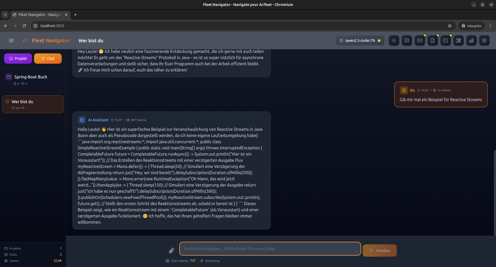

# Fleet Navigator 🚢

**Deine private AI - kostenlos, lokal und ohne Cloud**

Eine benutzerfreundliche Anwendung für Gespräche mit künstlicher Intelligenz - entwickelt von JavaFleet Systems Consulting.

**Powered by llama.cpp** - Die schnellste lokale AI-Engine für dein System!



---

## 🎯 Für wen ist Fleet Navigator?

Fleet Navigator ist für **jeden**, der eine private AI nutzen möchte:

- 📝 **Briefe schreiben**: Bewerbungen, Kündigungen, Geschäftsbriefe
- 💬 **Fragen stellen**: Zu jedem Thema - Geschichte, Wissenschaft, Alltag
- 🌐 **Übersetzen**: Texte in viele Sprachen
- 📚 **Lernen**: Komplexe Themen einfach erklärt
- 💻 **Programmieren**: Code schreiben und verstehen (für Entwickler)

**Deine Daten bleiben bei dir!** Im Gegensatz zu ChatGPT läuft alles auf deinem Computer.

---

## ✨ Was kann Fleet Navigator?

- ✅ **Privatsphäre**: Alle Daten bleiben auf deinem Computer
- ✅ **Kostenlos**: Keine monatlichen Gebühren
- ✅ **Offline**: Funktioniert ohne Internet (nach dem Setup)
- ✅ **Model Store**: Lade AI-Modelle direkt aus HuggingFace herunter - keine externe Software nötig!
- ✅ **Blitzschnell**: Powered by llama.cpp - optimiert für deine Hardware (CPU & GPU)
- ✅ **Brief-Agent**: Generiert Briefe und öffnet sie automatisch in Word/LibreOffice
- ✅ **Brief-Vorlagen**: Fertige Vorlagen für häufige Schreibanlässe
- ✅ **System Prompts**: 12+ vorkonfigurierte Persönlichkeiten (Karla, Steuerberater, Pirat, Shakespeare, uvm.)
- ✅ **Brief-Assistenten**: Spezialisierte Prompts für Behördenbriefe (Kita, Finanzamt, Stadtverwaltung)
- ✅ **Multi-Sprache**: Deutsch, Englisch - automatische Erkennung der Systemsprache
- ✅ **Vision Support**: Analysiere Bilder und PDFs mit Vision-Modellen (llava, bakllava)
- ✅ **Projekte & Chats**: Organisiere deine Gespräche in Projekten
- ✅ **Collapsible Sidebar**: Mehr Platz durch ausblendbare Seitenleiste
- ✅ **System-Check**: Prüft automatisch, ob alles richtig installiert ist

---

## 🚀 Installation (Schritt für Schritt)

### Windows

#### Schritt 1: Fleet Navigator herunterladen
1. Gehe zu: https://github.com/FranzHerstellJavaFleet/fleet-navigator
2. Klicke auf "Releases" (rechte Seite)
3. Lade `fleet-navigator-windows-amd64.zip` herunter
4. Entpacke die ZIP-Datei

#### Schritt 2: Starten
1. Doppelklick auf `fleet-navigator.exe`
2. Öffne im Browser: http://localhost:2025

#### Schritt 3: AI-Modell herunterladen
1. Im Fleet Navigator klicke auf **"Modelle"** in der Sidebar
2. Wähle ein Modell aus (z.B. **Qwen2.5-3B** für 8GB RAM oder **Llama-3.2-1B** für 4GB RAM)
3. Klicke auf **"Download"**
4. Warte, bis der Download abgeschlossen ist (Progress wird live angezeigt)
5. Das Modell ist sofort einsatzbereit!

### macOS

#### Schritt 1: Fleet Navigator herunterladen
1. Gehe zu: https://github.com/FranzHerstellJavaFleet/fleet-navigator
2. Klicke auf "Releases"
3. Lade `fleet-navigator-macos-amd64.tar.gz` herunter
4. Entpacke die Datei

#### Schritt 2: Starten
```bash
cd fleet-navigator
./fleet-navigator
```

Browser öffnet automatisch: http://localhost:2025

#### Schritt 3: AI-Modell herunterladen
1. Im Fleet Navigator klicke auf **"Modelle"** in der Sidebar
2. Wähle ein Modell aus der kuratierten Liste (empfohlen: **Qwen2.5-3B** oder **Llama-3.2-1B**)
3. Klicke auf **"Download"**
4. Der Download startet automatisch - Live-Progress wird angezeigt
5. Nach dem Download ist das Modell sofort einsatzbereit!

### Linux (Ubuntu/Debian)

#### Schritt 1: Fleet Navigator herunterladen
```bash
# Gehe zu Releases und lade herunter:
wget https://github.com/FranzHerstellJavaFleet/fleet-navigator/releases/latest/download/fleet-navigator-linux-amd64.tar.gz

# Entpacken:
tar -xzf fleet-navigator-linux-amd64.tar.gz
cd fleet-navigator
```

#### Schritt 2: Starten
```bash
./fleet-navigator
```

Browser: http://localhost:2025

#### Schritt 3: AI-Modell herunterladen
1. Im Fleet Navigator klicke auf **"Modelle"** in der Sidebar
2. Wähle ein Modell aus:
   - **Qwen2.5-3B-Instruct** (empfohlen für 8GB RAM) - Deutsch + Englisch
   - **Llama-3.2-1B-Instruct** (für 4GB RAM) - Englisch
   - **Llava-1.5-7B** (für Bildanalyse) - benötigt 8GB+ RAM
3. Klicke auf **"Download"**
4. Der Download läuft direkt von HuggingFace - kein Ollama oder andere Tools nötig!
5. Live-Progress zeigt MB/s und verbleibende Zeit
6. Nach dem Download ist das Modell sofort verfügbar!

---

## 📖 Erste Schritte

### 1. System-Check

Beim ersten Start prüft Fleet Navigator automatisch:
- ✅ Ist die llama.cpp Engine bereit?
- ✅ Ist ein AI-Modell heruntergeladen?
- ✅ Ist genug Arbeitsspeicher verfügbar?

**Falls noch kein Modell vorhanden ist**, wirst du automatisch zum Model Store weitergeleitet!

**Empfehlung für den Start:**
- **4-8 GB RAM**: Llama-3.2-1B-Instruct (~1.3 GB Download)
- **8-16 GB RAM**: Qwen2.5-3B-Instruct (~2 GB Download)
- **16+ GB RAM**: Qwen2.5-7B-Instruct (~4.4 GB Download)

### 2. Brief schreiben

1. Klicke auf das **Dokument-Symbol** oben rechts
2. Wähle eine **Vorlage** aus (z.B. "Bewerbungsschreiben")
3. Ersetze die Platzhalter `[...]` mit deinen Informationen
4. Klicke auf **"Generieren"**
5. Die AI erstellt den Brief - du kannst ihn kopieren und anpassen

### 3. Fragen stellen

1. Tippe deine Frage unten in das Eingabefeld
2. Drücke Enter
3. Die AI antwortet in wenigen Sekunden

**Beispiel-Fragen:**
- "Erkläre mir, wie Photosynthese funktioniert"
- "Was ist der Unterschied zwischen Java und JavaScript?"
- "Schreibe ein Gedicht über den Herbst"
- "Wie kündige ich meinen Handyvertrag?"

### 4. Dokumente analysieren

1. Klicke auf das **Büroklammer-Symbol** 📎
2. Wähle ein PDF oder Bild aus
3. Stelle eine Frage zum Dokument
4. Die AI analysiert das Dokument und antwortet

---

## 💡 Tipps für gute Ergebnisse

### Klare Anweisungen geben
❌ Schlecht: "Schreib was über Bewerbung"
✅ Gut: "Schreibe ein Bewerbungsschreiben für eine Stelle als Softwareentwickler bei Microsoft. Betone meine 5 Jahre Erfahrung mit Java und Python."

### Kontext angeben
Je mehr Informationen du gibst, desto besser die Antwort:
- Wer ist der Empfänger?
- Was ist der Anlass?
- Welcher Ton ist passend? (formell/informell)

### Schritt für Schritt
Bei komplexen Aufgaben: Teile sie in mehrere Fragen auf.

---

## 🔧 Empfohlene AI-Modelle (aus HuggingFace Model Store)

Fleet Navigator lädt Modelle **direkt aus HuggingFace** herunter - keine externe Software nötig!

### Kuratierte Modelle (empfohlen für Einsteiger)

| Modell | Größe | RAM | Am besten für |
|--------|-------|-----|---------------|
| **Llama-3.2-1B-Instruct** | 1.3 GB | 4-8 GB | Schnelle Antworten, Englisch |
| **Qwen2.5-3B-Instruct** | 2 GB | 8 GB | **Beste Wahl!** Deutsch + Englisch, gute Qualität |
| **Qwen2.5-7B-Instruct** | 4.4 GB | 16 GB | Noch bessere Qualität, mehrsprachig |
| **Llava-1.5-7B** | 4.7 GB | 8+ GB | **Bildanalyse** - PDF/Fotos verstehen |
| **DeepSeek-Coder-1.3B** | 1.5 GB | 4-8 GB | Programmierung, Code-Generierung |

### HuggingFace Suche (Tausende weitere Modelle!)

1. Klicke im Model Store auf **"HuggingFace durchsuchen"**
2. Suche nach Modellen (z.B. "german", "vision", "code")
3. Filtere nach:
   - **Popular** - Meistgenutzte Modelle
   - **German** - Deutsche Sprachmodelle
   - **Instruct** - Chat/Dialog-Modelle
   - **Code** - Programmier-Assistenten
   - **Vision** - Bildanalyse

### Welches Modell für mich?

- **4-8 GB RAM**: Llama-3.2-1B oder DeepSeek-Coder-1.3B
- **8-16 GB RAM**: **Qwen2.5-3B** (beste Wahl!) oder Llava-1.5-7B (Bilder)
- **16-32 GB RAM**: Qwen2.5-7B oder Qwen2.5-Coder-7B
- **32+ GB RAM**: Llama-3.1-70B oder Qwen2.5-14B

**Tipp:** Lade zuerst ein kleines Modell (Qwen2.5-3B) zum Testen herunter!

---

## 📝 Brief-Agent - Automatische Textverarbeitung

Der Brief-Agent ist ein **besonderes Feature** für Briefe und Dokumente:

### Wie funktioniert's?

1. **Klicke auf "Briefe"** in der Sidebar
2. **Wähle eine Vorlage** oder beschreibe deinen Brief
3. **AI generiert den Brief** mit deinen persönlichen Daten
4. **Brief öffnet sich automatisch** in deiner Textverarbeitung
5. **Rechtschreibprüfung**, Formatierung, als PDF speichern oder drucken

### Welche Textverarbeitung?

Der Brief-Agent unterstützt **mehrere Programme**:

| Betriebssystem | Programme |
|----------------|-----------|
| **Windows** | Microsoft Word, LibreOffice, OnlyOffice, Notepad |
| **macOS** | Microsoft Word, LibreOffice, OnlyOffice, TextEdit |
| **Linux** | LibreOffice, OnlyOffice, WPS Office, AbiWord, gedit |

**Empfehlung:**
- **Windows**: Microsoft Word (wenn vorhanden) oder LibreOffice (kostenlos)
- **macOS/Linux**: LibreOffice (kostenlos)

### Wo werden Briefe gespeichert?

Alle generierten Briefe werden in diesem Ordner abgelegt:

- **Windows**: `C:\Users\[Dein Name]\FleetNavigator\Documents\`
- **macOS**: `/Users/[Dein Name]/FleetNavigator/Documents/`
- **Linux**: `/home/[Dein Name]/FleetNavigator/Documents/`

### Persönliche Daten

Beim ersten Start erstellt Fleet Navigator **Platzhalter-Daten** (Max Mustermann, Musterweg 1, 12345 Musterstadt).

**Diese Daten MUSST du ersetzen!**

1. Klicke auf **"Einstellungen"** in der Sidebar
2. Gehe zu **"Persönliche Daten"**
3. Trage deine echten Daten ein
4. Speichern

Ab jetzt werden **alle Briefe automatisch** mit deinen Daten erstellt!

---

## ❓ Häufige Fragen

### Die Anwendung startet nicht
**Lösung:**
1. Prüfe, ob Port 2025 bereits belegt ist:
   ```bash
   # Linux/macOS
   lsof -ti:2025

   # Windows
   netstat -ano | findstr :2025
   ```
2. Starte Fleet Navigator neu

### "Keine Modelle gefunden"
**Lösung:**
1. Klicke auf **"Modelle"** in der Sidebar
2. Wähle ein Modell aus der kuratierten Liste (z.B. Qwen2.5-3B)
3. Klicke auf **"Download"**
4. Warte, bis der Download abgeschlossen ist
5. Das Modell ist sofort verfügbar!

### Download sehr langsam
**Ursache:** HuggingFace Server können bei großen Modellen langsam sein

**Lösung:**
- Lade kleinere Modelle zuerst (Qwen2.5-3B statt 7B)
- Prüfe deine Internetverbindung
- Download läuft im Hintergrund - du kannst den Browser schließen

### Antworten sind sehr langsam
**Ursachen:**
- Zu wenig RAM → Nutze kleineres Modell
- CPU zu schwach → Nutze Modell mit weniger Parametern
- Andere Programme schließen

### Kann ich mehrere Modelle gleichzeitig nutzen?
Ja! Fleet Navigator wählt automatisch das beste Modell für deine Aufgabe.

### Kostet das etwas?
**Nein!** Fleet Navigator, llama.cpp und alle Modelle von HuggingFace sind komplett kostenlos und Open Source.

### Funktioniert es offline?
Ja, nach der Installation und dem Download der Modelle benötigst du kein Internet mehr.

---

## 🔐 Datenschutz & Sicherheit

✅ **Keine Cloud**: Alle Daten bleiben auf deinem Computer
✅ **Keine Tracking**: Wir sammeln keine Nutzungsdaten
✅ **Open Source**: Der gesamte Code ist einsehbar
✅ **Lokale Datenbank**: Chats werden nur lokal gespeichert

### Wo werden meine Chats gespeichert?

- **Windows**: `C:\Users\[Dein Name]\.fleet-navigator\`
- **macOS**: `/Users/[Dein Name]/.fleet-navigator/`
- **Linux**: `/home/[Dein Name]/.fleet-navigator/`

Du kannst diese Dateien jederzeit löschen oder sichern.

---

## 🛠️ Für Entwickler

### Aus Quellcode bauen

```bash
# Repository klonen
git clone https://github.com/FranzHerstellJavaFleet/fleet-navigator.git
cd fleet-navigator

# Mit Maven bauen
mvn clean package

# Starten
java -jar target/fleet-navigator-0.1.0-SNAPSHOT.jar
```

### Development Mode

```bash
# Backend starten (Port 2025)
mvn spring-boot:run

# Frontend starten (Port 5173)
cd frontend
npm install
npm run dev
```

### Technologie-Stack

- **Backend**: Spring Boot 3.2, Java 17
- **Frontend**: Vue.js 3, Vite, Tailwind CSS
- **Datenbank**: H2 (file-based)
- **AI Engine**: llama.cpp (via java-llama.cpp JNI bindings)
- **Model Source**: HuggingFace Model Hub (GGUF format)
- **Monitoring**: OSHI (Hardware-Überwachung)

### Native Image (GraalVM)

Für schnelleren Start und weniger RAM-Verbrauch:

```bash
mvn -Pnative clean package
```

Mehr Infos: [NATIVE-IMAGE.md](NATIVE-IMAGE.md)

---

## 📞 Unterstützung & Community

### Bei Problemen

1. **System-Check** im Browser aufrufen: http://localhost:2025
2. **Logs** prüfen (Terminal-Ausgabe)
3. **GitHub Issues**: https://github.com/FranzHerstellJavaFleet/fleet-navigator/issues

### Dokumentation

- [GraalVM Native Image Guide](docs/NATIVE-IMAGE.md)
- [HuggingFace Integration](docs/HUGGINGFACE-INTEGRATION.md)
- [Vision Support Status](docs/VISION-SUPPORT-STATUS.md)
- [GitHub Actions Setup](docs/GITHUB-ACTIONS-GUIDE.md)
- [Vollständige Doku-Index](docs/INDEX.md)

### Updates

Fleet Navigator prüft **nicht** automatisch auf Updates.
Neue Versionen findest du auf GitHub unter "Releases".

---

## 📜 Lizenz

Fleet Navigator ist Open Source Software unter der MIT-Lizenz.
Du darfst die Software frei nutzen, verändern und weitergeben.

---

## 🙏 Danksagungen

- **llama.cpp Team** - Für die schnellste lokale AI-Engine
- **HuggingFace** - Für den Zugang zu tausenden Open-Source-Modellen
- **Spring Boot** & **Vue.js** Communities
- **Meta** - Für die Llama-Modelle
- **Alibaba Cloud** - Für die Qwen-Modelle
- **Georgi Gerganov** - Für llama.cpp
- **kherud** - Für java-llama.cpp JNI bindings

---

## 🚢 Entwickelt von

**JavaFleet Systems Consulting**
Port 2025 - Das Geburtsjahr von Fleet Navigator

---

## 📥 Download

Native Binaries (ohne JDK!) für Windows, macOS und Linux sind unter **Releases** verfügbar:
https://github.com/FranzHerstellJavaFleet/fleet-navigator/releases

---

**🌟 Gefällt dir Fleet Navigator? Gib uns einen Stern auf GitHub!**

https://github.com/FranzHerstellJavaFleet/fleet-navigator
